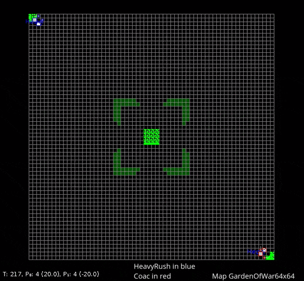

# coac-ai-microrts
Coac rule-based AI for [microRTS Competition](https://github.com/santiontanon/microrts)

## Installation
- Clone this repository and [microRTS](https://github.com/santiontanon/microrts)
- Copy the folder `coac-ai-microrts/src` to the `microrts/src`. 

Note: The AI was developed using the microRTS version [88cdc76](https://github.com/santiontanon/microrts/commit/88cdc76d0e5c624e78ae562c8771fc0a863814ad). It should also work on newer versions if there is no breaking change.

## Usage

Add the `CoacAI.class` to the `AIs` array in `src/gui/frontend/FEStatePane.java`

You can then run the `FrontEnd.java` and select the AI.

